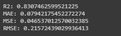

# Zomato-Bangalore-Restaurant-Rating-Prediction

 

## Business Objectives :

The basic idea of analyzing the Zomato dataset is to get a fair idea about the factors affecting the establishment of different types of restaurant at different places in Bengaluru, aggregate rating of each restaurant, Bengaluru being one such city has more than 12,000 restaurants with restaurants serving dishes from all over the world. With such an high number of restaurants. This industry hasn't been saturated yet. And new restaurants are opening every day. However it has become difficult for them to compete with already established restaurants. The key issues that continue to pose a challenge to them include high real estate costs, rising food costs, shortage of quality manpower, fragmented supply chain and over-licensing. 

This Zomato data aims at analysing demography of the location. Most importantly it will help new restaurants in deciding their theme, menus, cuisine, cost etc for a particular location. It also aims at finding similarity between neighborhoods of Bengaluru on the basis of food.

The dataset also contains reviews for each of the restaurant which will help in finding overall rating for the place. So we will try to predict rating for particular restaurant.

## Data Collection :

The dataset has been obtained from kaggle. 

Link : https://www.kaggle.com/himanshupoddar/zomato-bangalore-restaurants

The data is accurate to that available on the zomato website until 15 March 2019.

## Modelling :

The following modelling approach was used in the project:

1. Loading and cleaning the raw data
2. Exploratory Data Analysis
3. Regression Model Building
4. Hyper-parameter Optimization

The detailed analysis and model creation can be found in the .ipynb file. 

## Result :

The performance of Random Forest after hyper-parameter optimization is as below:

## Conclusions :

This project has built a model that can predict Bengalore Restaurant Rating. 

Many different regressors and ANNs were used in this project.

Out of various regression algorithms, RandomForest tends to give us most balanced performance with:
1.   R2: 0.8307462599521225
2.   MAE: 0.07942175452272274
3.   MSE: 0.046537012570032385
4.   RMSE: 0.21572439029936413
